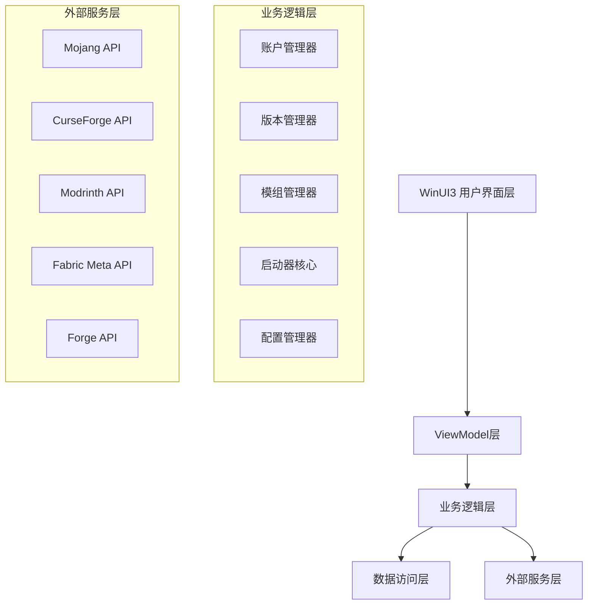

# Yuuki Minecraft启动器设计文档

## 概述

Yuuki是一个基于C# WinUI3的现代化Minecraft启动器，采用MVVM架构模式和模块化设计。系统遵循Microsoft Fluent Design设计原则，提供直观、美观且功能强大的用户体验。

## 架构

### 整体架构



### 技术栈

- **前端框架**: WinUI3 + C# 12
- **架构模式**: MVVM (Model-View-ViewModel)
- **依赖注入**: Microsoft.Extensions.DependencyInjection
- **HTTP客户端**: HttpClient + Polly (重试策略)
- **JSON序列化**: System.Text.Json
- **数据存储**: SQLite + Entity Framework Core
- **认证**: Microsoft Authentication Library (MSAL)
- **日志**: Microsoft.Extensions.Logging + Serilog

## 组件和接口

### 1. 用户界面层

#### 主要页面结构
```
MainWindow
├── NavigationView (主导航)
│   ├── HomePage (首页/游戏实例)
│   ├── VersionsPage (版本管理)
│   ├── ModsPage (模组管理)
│   ├── AccountsPage (账户管理)
│   ├── SettingsPage (设置)
│   └── AboutPage (关于)
└── StatusBar (状态栏)
```

#### 核心UI组件
- **GameInstanceCard**: 游戏实例卡片，支持启动、编辑、删除操作
- **VersionSelector**: 版本选择器，支持原版、Fabric、Forge、NeoForge
- **ModCard**: 模组卡片，显示模组信息和管理操作
- **ProgressDialog**: 下载进度对话框
- **AccountCard**: 账户信息卡片

### 2. ViewModel层

#### IGameInstanceViewModel
```csharp
public interface IGameInstanceViewModel
{
    ObservableCollection<GameInstance> GameInstances { get; }
    ICommand CreateInstanceCommand { get; }
    ICommand LaunchGameCommand { get; }
    ICommand DeleteInstanceCommand { get; }
    Task LoadGameInstancesAsync();
}
```

#### IVersionManagerViewModel
```csharp
public interface IVersionManagerViewModel
{
    ObservableCollection<MinecraftVersion> AvailableVersions { get; }
    ObservableCollection<ModLoader> ModLoaders { get; }
    ICommand DownloadVersionCommand { get; }
    ICommand RefreshVersionsCommand { get; }
    Task LoadVersionsAsync();
}
```

### 3. 业务逻辑层

#### IAccountManager
```csharp
public interface IAccountManager
{
    Task<AuthResult> AuthenticateAsync();
    Task<bool> RefreshTokenAsync();
    Task<UserProfile> GetUserProfileAsync();
    Task SignOutAsync();
    bool IsAuthenticated { get; }
}
```

#### IVersionManager
```csharp
public interface IVersionManager
{
    Task<List<MinecraftVersion>> GetAvailableVersionsAsync();
    Task<List<ModLoaderVersion>> GetModLoaderVersionsAsync(ModLoaderType type);
    Task<DownloadResult> DownloadVersionAsync(string versionId, ModLoaderType? modLoader = null);
    Task<bool> DeleteVersionAsync(string versionId);
}
```

#### IModManager
```csharp
public interface IModManager
{
    Task<List<ModInfo>> SearchModsAsync(string query, ModPlatform platform);
    Task<DownloadResult> DownloadModAsync(string modId, string versionId);
    Task<List<ModInfo>> GetInstalledModsAsync(string instanceId);
    Task<bool> EnableModAsync(string instanceId, string modId);
    Task<bool> DisableModAsync(string instanceId, string modId);
}
```

#### ILauncherCore
```csharp
public interface ILauncherCore
{
    Task<LaunchResult> LaunchGameAsync(GameInstance instance, LaunchOptions options);
    Task<bool> ValidateGameFilesAsync(string instanceId);
    Task<ProcessInfo> GetGameProcessInfoAsync(string instanceId);
    event EventHandler<LaunchProgressEventArgs> LaunchProgress;
}
```

## 数据模型

### 核心实体

#### GameInstance
```csharp
public class GameInstance
{
    public string Id { get; set; }
    public string Name { get; set; }
    public string MinecraftVersion { get; set; }
    public ModLoaderType? ModLoader { get; set; }
    public string ModLoaderVersion { get; set; }
    public LaunchSettings LaunchSettings { get; set; }
    public List<InstalledMod> InstalledMods { get; set; }
    public DateTime CreatedAt { get; set; }
    public DateTime LastPlayed { get; set; }
}
```

#### MinecraftVersion
```csharp
public class MinecraftVersion
{
    public string Id { get; set; }
    public string Type { get; set; } // release, snapshot, old_beta, old_alpha
    public DateTime ReleaseTime { get; set; }
    public string Url { get; set; }
    public List<ModLoaderCompatibility> SupportedModLoaders { get; set; }
}
```

#### ModInfo
```csharp
public class ModInfo
{
    public string Id { get; set; }
    public string Name { get; set; }
    public string Description { get; set; }
    public string Author { get; set; }
    public string IconUrl { get; set; }
    public List<string> SupportedVersions { get; set; }
    public ModPlatform Platform { get; set; }
    public List<ModDependency> Dependencies { get; set; }
}
```

### 枚举类型

```csharp
public enum ModLoaderType
{
    Fabric,
    Forge,
    NeoForge
}

public enum ModPlatform
{
    CurseForge,
    Modrinth
}

public enum LaunchState
{
    Idle,
    Preparing,
    Downloading,
    Installing,
    Launching,
    Running,
    Error
}
```

## 错误处理

### 异常层次结构
```csharp
public abstract class YuukiException : Exception
{
    public string ErrorCode { get; }
    public YuukiException(string errorCode, string message) : base(message)
    {
        ErrorCode = errorCode;
    }
}

public class AuthenticationException : YuukiException
{
    public AuthenticationException(string message) : base("AUTH_ERROR", message) { }
}

public class DownloadException : YuukiException
{
    public DownloadException(string message) : base("DOWNLOAD_ERROR", message) { }
}

public class LaunchException : YuukiException
{
    public LaunchException(string message) : base("LAUNCH_ERROR", message) { }
}
```

### 错误处理策略
1. **网络错误**: 使用Polly实现指数退避重试策略
2. **认证错误**: 自动尝试刷新令牌，失败后提示重新登录
3. **文件系统错误**: 提供详细错误信息和修复建议
4. **启动错误**: 收集崩溃日志并提供诊断信息

## 测试策略

### 单元测试
- **覆盖范围**: 业务逻辑层的所有核心功能
- **测试框架**: xUnit + Moq + FluentAssertions
- **重点测试**:
  - 版本下载和安装逻辑
  - 模组依赖解析
  - 启动参数生成
  - 认证流程

### 集成测试
- **API集成**: 测试与Mojang、CurseForge、Modrinth API的集成
- **文件系统**: 测试文件下载、解压、安装流程
- **数据库**: 测试Entity Framework Core数据访问

### UI测试
- **自动化测试**: 使用WinUI3测试框架测试关键用户流程
- **手动测试**: 重点测试Fluent Design效果和用户体验

## Fluent Design实现

### 设计原则实现

#### 1. Light (光感)
- 使用Acrylic材质作为背景
- 实现Reveal高亮效果
- 添加适当的阴影和深度

#### 2. Depth (深度)
- 使用Z轴分层布局
- 实现视差滚动效果
- 卡片式设计增强层次感

#### 3. Motion (动效)
- 页面切换使用Connected Animation
- 列表项使用Entrance Animation
- 按钮交互使用Pointer Animation

#### 4. Material (材质)
- 主要使用Acrylic和Mica材质
- 根据内容调整透明度
- 支持浅色/深色主题切换

#### 5. Scale (缩放)
- 响应式布局适配不同屏幕尺寸
- 支持触摸和鼠标交互
- 自适应字体大小

### 主题系统
```csharp
public class ThemeManager
{
    public ThemeType CurrentTheme { get; set; }
    public event EventHandler<ThemeChangedEventArgs> ThemeChanged;
    
    public void ApplyTheme(ThemeType theme)
    {
        // 应用主题资源
        // 更新Acrylic材质
        // 触发主题变更事件
    }
}
```

## 性能优化

### 启动性能
- 使用异步初始化避免阻塞UI线程
- 实现延迟加载减少启动时间
- 缓存常用数据减少API调用

### 内存管理
- 使用弱引用避免内存泄漏
- 及时释放大文件资源
- 实现图片缓存和回收机制

### 网络优化
- 实现并发下载提高速度
- 使用断点续传支持大文件下载
- 压缩API请求减少带宽使用

## 安全考虑

### 认证安全
- 使用MSAL库确保OAuth2.0安全实现
- 安全存储访问令牌和刷新令牌
- 实现令牌自动刷新机制

### 文件安全
- 验证下载文件的完整性和签名
- 使用安全的文件路径避免路径遍历攻击
- 实现文件权限检查

### 网络安全
- 使用HTTPS确保通信安全
- 验证SSL证书避免中间人攻击
- 实现请求签名验证